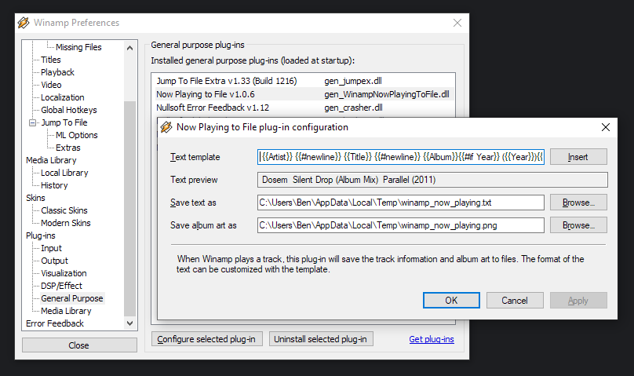

Winamp Now Playing to File
===

[](https://github.com/Aldaviva/WinampNowPlayingToFile/actions/workflows/msbuild.yml) [![Test status](https://img.shields.io/testspace/tests/Aldaviva/Aldaviva:WinampNowPlayingToFile/master?passed_label=passing&failed_label=failing&logo=data%3Aimage%2Fsvg%2Bxml%3Bbase64%2CPHN2ZyB4bWxucz0iaHR0cDovL3d3dy53My5vcmcvMjAwMC9zdmciIHZpZXdCb3g9IjAgMCA4NTkgODYxIj48cGF0aCBkPSJtNTk4IDUxMy05NCA5NCAyOCAyNyA5NC05NC0yOC0yN3pNMzA2IDIyNmwtOTQgOTQgMjggMjggOTQtOTQtMjgtMjh6bS00NiAyODctMjcgMjcgOTQgOTQgMjctMjctOTQtOTR6bTI5My0yODctMjcgMjggOTQgOTQgMjctMjgtOTQtOTR6TTQzMiA4NjFjNDEuMzMgMCA3Ni44My0xNC42NyAxMDYuNS00NFM1ODMgNzUyIDU4MyA3MTBjMC00MS4zMy0xNC44My03Ni44My00NC41LTEwNi41UzQ3My4zMyA1NTkgNDMyIDU1OWMtNDIgMC03Ny42NyAxNC44My0xMDcgNDQuNXMtNDQgNjUuMTctNDQgMTA2LjVjMCA0MiAxNC42NyA3Ny42NyA0NCAxMDdzNjUgNDQgMTA3IDQ0em0wLTU1OWM0MS4zMyAwIDc2LjgzLTE0LjgzIDEwNi41LTQ0LjVTNTgzIDE5Mi4zMyA1ODMgMTUxYzAtNDItMTQuODMtNzcuNjctNDQuNS0xMDdTNDczLjMzIDAgNDMyIDBjLTQyIDAtNzcuNjcgMTQuNjctMTA3IDQ0cy00NCA2NS00NCAxMDdjMCA0MS4zMyAxNC42NyA3Ni44MyA0NCAxMDYuNVMzOTAgMzAyIDQzMiAzMDJ6bTI3NiAyODJjNDIgMCA3Ny42Ny0xNC44MyAxMDctNDQuNXM0NC02NS4xNyA0NC0xMDYuNWMwLTQyLTE0LjY3LTc3LjY3LTQ0LTEwN3MtNjUtNDQtMTA3LTQ0Yy00MS4zMyAwLTc2LjY3IDE0LjY3LTEwNiA0NHMtNDQgNjUtNDQgMTA3YzAgNDEuMzMgMTQuNjcgNzYuODMgNDQgMTA2LjVTNjY2LjY3IDU4NCA3MDggNTg0em0tNTU3IDBjNDIgMCA3Ny42Ny0xNC44MyAxMDctNDQuNXM0NC02NS4xNyA0NC0xMDYuNWMwLTQyLTE0LjY3LTc3LjY3LTQ0LTEwN3MtNjUtNDQtMTA3LTQ0Yy00MS4zMyAwLTc2LjgzIDE0LjY3LTEwNi41IDQ0UzAgMzkxIDAgNDMzYzAgNDEuMzMgMTQuODMgNzYuODMgNDQuNSAxMDYuNVMxMDkuNjcgNTg0IDE1MSA1ODR6IiBmaWxsPSIjZmZmIi8%2BPC9zdmc%2B)](https://aldaviva.testspace.com/spaces/206386) [](https://coveralls.io/github/Aldaviva/WinampNowPlayingToFile?branch=master)

This is a plugin for [Winamp](http://www.winamp.com/) that saves text information and album art for the currently playing song to files on your computer. You can customize where the files are saved, as well as the format of the text.

<!-- MarkdownTOC autolink="true" bracket="round" autoanchor="false" levels="1,2,3,4" -->

- [Problem](#problem)
- [Solution](#solution)
- [Installation](#installation)
- [Configuration](#configuration)
    - [Text](#text)
        - [Metadata fields](#metadata-fields)
        - [Helpers](#helpers)
        - [Formatting](#formatting)
    - [Album art](#album-art)
        - [Fallback artwork](#fallback-artwork)
- [Integration](#integration)
    - [OBS](#obs)
- [Uninstallation](#uninstallation)

<!-- /MarkdownTOC -->

## Problem

I was broadcasting video game streams on [my Twitch.tv channel](https://twitch.tv/aldaviva), in which I also play music in the background. I wanted viewers to be able to tell which song I was playing at any given time in case they liked it and wanted to find it for themselves. I started using the [Advanced mIRC Integration Plug-In (AMIP)](http://amip.tools-for.net/wiki/), which is generally used for showing your Now Playing status in IRC using [mIRC](https://www.mirc.com/). It also lets you save the status to a text file, which I added as a Text Source in [OBS](https://obsproject.com/).

Unfortunately, AMIP only supports encoding the text using ANSI, OEM (DOS), FIDO, or KOI8 character encodings, none of which are UTF-8, which OBS requires. For example, [Jävla Sladdar](https://www.youtube.com/watch?v=zaCZ9VkJ-so) was being shown in the video stream as `J�vla Sladdar`, because even though AMIP was saving `ä` using ANSI (`0xe4`), OBS was decoding the file with UTF-8, so the character was not properly decoded. In UTF-8, `ä` is supposed to be encoded as `0xc3 0xa4` because `0xe4` is greater than `0x7f` (i.e. `0x34` requires more than 7 bits to represent), so it spills over into a second code unit (it's a multibyte character).

## Solution

I wrote my own Winamp plugin to save information about the currently playing song to a UTF-8 text file, and the song's album art to an image file.

## Installation

1. Ensure you have [Microsoft .NET Framework 4.7.2](https://dotnet.microsoft.com/download/dotnet-framework) Runtime or later installed. This is included in Windows 10 version 1803 and later.
1. Exit Winamp if it's already running.
1. Download [**`WinampNowPlayingToFile.zip`**](https://github.com/Aldaviva/WinampNowPlayingToFile/releases/latest/download/WinampNowPlayingToFile.zip) from the [latest release](https://github.com/Aldaviva/WinampNowPlayingToFile/releases) (not the source code ZIP file).
1. Extract the archive to your Winamp installation directory.
    ```
    📁 C:\Program Files (x86)\Winamp
    ├── 📁 plugins
    │   └── 📄 gen_WinampNowPlayingToFile.dll
    ├── 📄 WinampNowPlayingToFile.dll
    ├── 📄 Daniel15.Sharpamp.dll
    ├── 📄 mustache-sharp.dll
    └── 📄 taglib-sharp.dll
    ```

## Configuration

Configuration of this plugin is performed in Winamp.

1. Start Winamp.
1. Go to Options › Preferences › Plug-ins › General Purpose.
1. Configure the Now Playing to File plugin.



*Changes are saved to the registry in `HKCU\Software\WinampNowPlayingToFile`.*

### Text

By default, this plugin saves textual information about the currently playing song to `winamp_now_playing.txt` in your user's temporary directory (`%TEMP%`). The file contains the track's Artist, Title, and Album (if applicable), for example
```text
U2 – Exit – The Joshua Tree
```

To customize the text file location and contents, go to the plugin preferences in Winamp.

1. You can change the file contents by editing the **Text template** and inserting placeholders inside `{{` `}}`, either with the **Insert** button or by typing them manually. See [Metadata fields](#metadata-fields) below for all the fields you can use in a placeholder. For example, a simple template that could render the above example text is
    ```handlebars
    {{Artist}} – {{Title}} – {{Album}}
    ```
1. As you fill in the template, the **Text preview** will be updated to show how the currently playing song would be rendered, or an example song if no song is available.
1. You can change where the file is written in your filesystem by selecting a different path for **Save text as**.

When Winamp is not playing a song, this text file will be truncated to 0 bytes.

#### Metadata fields

Metadata values that are missing or empty will be rendered as the empty string.

|Field name|Type|Examples|Notes|
|-|-|-|-|
|`Album`|string|`The Joshua Tree`||
|`AlbumArtist`|string|`U2`||
|`Artist`|string|`U2`||
|`Bitrate`|int|`320`||
|`BPM`|int|`123`|Beats per minute|
|`Category`|string|`Rock`||
|`Comment`|string|||
|`Composer`|string|`U2`||
|`Conductor`|string|||
|`Director`|string||Most commonly used for video files|
|`Disc`|int|`1`|If it can't be parsed as an int (like `1/2`) it will be a string|
|`Family`|string|`MPEG Layer 3 Audio File`|Codec or container format|
|`FileBasename`|string|`Exit.mp3`|Filename without path|
|`FileBasenameWithoutExtension`|string|`Exit`|Filename without path or extension|
|`Filename`|string|`C:\Users\Ben\Music\Exit.mp3`|Absolute path to file, or a stream URL|
|`Gain`|string|`+0.92 dB`||
|`Genre`|string|`Rock`||
|`ISRC`|string|`GBUM70709782`|12-character [International Standard Recording Code](https://en.wikipedia.org/wiki/International_Standard_Recording_Code) for the track|
|`Key`|string|`E minor`||
|`Length`|TimeSpan|`00:04:11.4220000`|See [formatting](#formatting) for `m:ss` and other formats|
|`Lossless`|bool|`false`|`true` for lossless compression, `false` for lossy|
|`Lyricist`|string|`Bono`||
|`Media`|string|`LP`||
|`Producer`|string|`Brian Eno, Daniel Lanois`||
|`Publisher`|string|`Island Records`||
|`Rating`|int|`2`|In the range [1, 5]|
|`ReplayGain_Album_Gain`|string|`-3.03 dB`||
|`ReplayGain_Album_Peak`|double|`1.022630334`||
|`ReplayGain_Track_Gain`|string|`-0.77 dB`||
|`ReplayGain_Track_Peak`|double|`1.006227493`||
|`Stereo`|bool|`true`|`true` for stereo, `false` for mono|
|`Subtitle`|string|||
|`Title`|string|`Exit`||
|`Tool`|string|`iTunes 10.5.1`|From the `ENCODEDBY` ID3v2 tag|
|`Track`|int|`1`|If it can't be parsed as an int (like `1/5`) it will be a string|
|`Type`|string|`audio`|`audio` or `video`|
|`VBR`|bool|`false`|`true` for variable bitrate, `false` for constant bitrate|
|`Year`|int|`1987`|If it can't be parsed as an int (like `1987-01-01`) it will be a string|

Any other values you use in a placeholder will be requested directly from Winamp, and the response will be output as-is. If you can find other fields that Winamp handles for audio files, please [file an enhancement issue](https://github.com/Aldaviva/WinampNowPlayingToFile/issues/new?labels=enhancement&title=New%20metadata%20field:%20) so it can be added to this program and documentation.

#### Helpers

Template logic can be added using [Handlebars expressions](https://handlebarsjs.com/), including the [built-in helpers](https://handlebarsjs.com/guide/builtin-helpers.html) like `{{#if expr}}`, `{{#elif expr}}`, `{{#else}}`, and `{{/if}}`. To output a line break (CRLF), use `{{#newline}}`.

For example, you can conditionally include artist and album only if those fields exist on your song and are nonempty.
```handlebars
{{#if Artist}}{{Artist}} – {{/if}}{{Title}}{{#if Album}} – {{Album}}{{/if}}
```

You can also render strings depending on a boolean value.
```handlebars
{{#if Lossless}}lossless{{#else}}lossy{{/if}}
```

#### Formatting

Metadata values may optionally be formatted using the [.NET string formatting syntax](https://learn.microsoft.com/en-us/dotnet/api/system.string.format?view=netframework-4.7.2&redirectedfrom=MSDN#remarks).

|Topic|Example Input|Output|Notes|
|-|-|-|-|
|Timespan|<pre lang="handlebars">{{Length:m\\:ss}}</pre>|`4:33`|See [standard](https://learn.microsoft.com/en-us/dotnet/standard/base-types/standard-timespan-format-strings) and [custom TimeSpan format strings](https://learn.microsoft.com/en-us/dotnet/standard/base-types/custom-timespan-format-strings)|
|Timespan|<pre lang="handlebars">{{Length:hh\\:mm\\:ss}}</pre>|`00:04:33`|See [standard](https://learn.microsoft.com/en-us/dotnet/standard/base-types/standard-timespan-format-strings) and [custom TimeSpan format strings](https://learn.microsoft.com/en-us/dotnet/standard/base-types/custom-timespan-format-strings)|
|Digit grouping|<pre lang="handlebars">{{Bitrate:N0}}kbps</pre>|`1,226kbps`|See [standard numeric format strings](https://learn.microsoft.com/en-us/dotnet/standard/base-types/standard-numeric-format-strings#numeric-format-specifier-n)|
|Floating point precision|<pre lang="handlebars">{{ReplayGain_Album_Peak:F6}}</pre>|`0.986115`|See [standard numeric format strings](https://learn.microsoft.com/en-us/dotnet/standard/base-types/standard-numeric-format-strings#fixed-point-format-specifier-f)|
|Zero padding|<pre lang="handlebars">#{{Track:00}}</pre>|`#06`|See [custom numeric format strings](https://learn.microsoft.com/en-us/dotnet/standard/base-types/custom-numeric-format-strings#the-0-custom-specifier)|
|Space padding|<pre lang="handlebars">{{Track,3}}.</pre>|`  1.`|See [spacing](https://learn.microsoft.com/en-us/dotnet/api/system.string.format?view=netframework-4.7.2&redirectedfrom=MSDN#control-spacing)|

### Album art

This plugin also copies the currently playing song's album art from the song metadata or from an image in the song's folder. By default, it is copied to `%TEMP%\winamp_now_playing.png`.

Note that the file extension is always the one you specify in the preferences, even if the album art has a different file type, to make it easier to refer to this file from other programs like OBS without having to deal with multiple possible file extensions. This means that this file may be created as a JPEG with the `.png` file extension, for example. Most programs, including OBS, can handle this case just fine, but the mismatch is a little silly. Feel free to change the file extension using the preferences.

You can customize the album art filename and path using **Save album art as** in the same plugin configuration dialog as the text file above.

#### Fallback artwork

When there is no album art, the copied files will be deleted. However, this may be undesirable because it can leave dependent interfaces in a weird-looking state (like an OBS layout with a big transparent gap where the album art would normally be), and it will also trigger the Missing Files warning dialog box each time you launch OBS.

To resolve this, you can specify custom image files that will be copied instead when there is no album art. Here are some sample [black](https://placehold.co/128x128/000f/0000.png) and [transparent](https://placehold.co/128x128/0000/0000.png) images to get started, or you can use your own. There are no requirements for the format or dimensions of these images besides what your downstream consumer like OBS accepts.

##### Missing artwork

When Winamp is playing a song with no album art, the image file will be deleted. To override this, save your desired image file as `emptyAlbumArt.png` in the Winamp installation directory.

##### Playback stopped

When Winamp is paused, stopped, or closed, the image file will be deleted. To override this, save your desired image file as `stoppedAlbumArt.png` in the Winamp installation directory.

## Integration

### OBS

1. Start playing a song in Winamp.
1. Create a new Text (GDI+) source in your OBS scene.
1. In the Properties for your text source, enable Read From File.
1. Select the text file created by this plugin (by default, `%TEMP%\winamp_now_playing.txt`).
1. Create a new Image source in your scene.
1. In the Properties for your image source, select the image file created by this plugin (by default, `%TEMP%\winamp_now_playing.png`).

## Uninstallation

1. In Winamp's Preferences, go to Plug-ins › General Purpose.
1. Select the Now Playing to File plugin, then click the Uninstall Selected Plug-In button.
1. Exit Winamp.
1. Delete all the files you extracted to the Winamp installation directory when installing this plugin.
    ```
    📁 C:\Program Files (x86)\Winamp
    ├── 📁 plugins
    │   └── 📄 gen_WinampNowPlayingToFile.dll
    ├── 📄 WinampNowPlayingToFile.dll
    ├── 📄 Daniel15.Sharpamp.dll
    ├── 📄 mustache-sharp.dll
    └── 📄 taglib-sharp.dll
    ```
1. Delete the song information files (by default, `winamp_now_playing.txt` and `winamp_now_playing.png` in `%TEMP%`).
1. Delete the plugin settings registry key `HKCU\Software\WinampNowPlayingToFile`.
